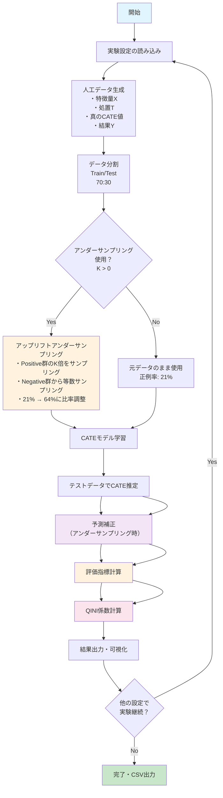

# クラス不均衡対応CATE推定実験フレームワーク

## 📊 概要

本リポジトリは、**条件付き平均処置効果（CATE：Conditional Average Treatment Effect）推定**実験を、**クラス不均衡処理**に焦点を当てて実装したものです。アップリフトアンダーサンプリング技術を用いて、様々なクラス不均衡シナリオ下での異なるCATE推定手法を比較する包括的なフレームワークを提供します。

### 🎯 主要機能

- **複数のCATEメソッド**: S-learner、T-learner、DR-learner、R-learner、因果フォレスト、因果木
- **アップリフトアンダーサンプリング**: クラス不均衡軽減のための設定可能K因子による適応的アンダーサンプリング
- **QINI係数評価**: 処置効果評価のための高度なアップリフトモデリング指標
- **柔軟なCLIインターフェース**: バッチ実験とカスタム設定のためのコマンドラインツール
- **包括的評価**: 実行時間追跡、バイアス分析、パフォーマンス指標
- **CSV出力**: さらなる分析のための構造化結果出力

## 🔄 実験フロー



### 📋 実験プロセス詳細

1. **データ準備フェーズ**
   - 人工データ生成（5次元特徴空間）
   - 処置・対照群の割り当て
   - Train/Test分割（デフォルト70:30）

2. **前処理フェーズ**
   - クラス不均衡の確認
   - アンダーサンプリングの適用（K因子設定）
   - 処置群・対照群別の調整

3. **モデル学習フェーズ**
   - 選択されたCATEメソッドでの学習
   - ハイパーパラメータ設定
   - 学習時間の記録

4. **評価フェーズ**
   - CATE推定精度の計算（RMSE、Bias、R²）
   - QINI係数による影響評価
   - 実行時間とメモリ使用量の測定

## 🚀 クイックスタート

### インストール

```powershell
# リポジトリディレクトリに移動
cd "c:\Users\oiwal\OneDrive\ドキュメント\class_imbalanced_cate_targeting"

# 依存関係のインストール
pip install -r requirements.txt
```

### 基本的な使用方法

```powershell
# プリセット実験の実行（デフォルト）
python main.py

# カスタムCLI実験の実行
python main.py --n-samples 1000 --cate-methods s_learner t_learner --k-values 0 2 5 --output results.csv

# 特定の報酬タイプと詳細出力での実行
python main.py --reward-type logistic --cate-methods causal_forest --verbose

# 異なるアンダーサンプリング因子でのテスト
python main.py --n-samples 500 --k-values 1 3 5 7 --output undersampling_comparison.csv
```

## 📁 リポジトリ構造

```
class_imbalanced_cate_targeting/
├── main.py                    # メインエントリーポイントとCLIインターフェース
├── requirements.txt           # Python依存関係
├── README.md                 # このファイル（日本語版）
├── README_ENG.md             # 英語版README
├── strategy.md               # プロジェクト戦略と方法論
├── structure.md              # 詳細なコード構造ドキュメント
├── 
├── data/                     # データ生成とハンドリング
│   ├── data_generator.py     # 人工データ生成
│   ├── criteo_data_generator.py  # 実世界Criteoデータセット処理
│   └── criteo-research-uplift-v2.1.csv.gz  # Criteoデータセット
├── 
├── shared/                   # コアフレームワークモジュール
│   ├── experiment_config.py  # 実験設定管理
│   ├── experiment_runner.py  # メイン実験実行ロジック
│   ├── cli_parser.py         # コマンドライン引数解析
│   ├── model.py              # CATEモデル実装
│   ├── imbalance_handler.py  # アップリフトアンダーサンプリングアルゴリズム
│   ├── qini_metrics.py       # QINI係数計算
│   ├── result_formatter.py   # 結果表示とフォーマット
│   └── visualization_utils.py # プロットと可視化
├── 
├── evaluation/               # 評価と指標
│   └── evaluation.py         # QINI統合CATE評価
├── 
├── test/                     # テストスクリプトと検証
│   ├── test_models.py        # モデルテストユーティリティ
│   ├── main_complete.py      # 包括的テストスイート
│   ├── quick_test.py         # 高速検証テスト
│   └── k_value_validation.py # K因子検証実験
└── 
└── results/                  # 実験出力
    ├── test_results.csv      # 最新テスト結果
    └── final_phase1_results.csv  # フェーズ1完了結果
```

## 🔬 実験設定

### サポートされるCATEメソッド

| メソッド | 説明 | 使用ケース |
|----------|------|------------|
| `s_learner` | 処置群・対照群統合モデル | シンプルなベースライン |
| `t_learner` | 各群別モデル | 標準的アプローチ |
| `dr_learner` | 二重ロバスト推定 | モデル誤指定に対してロバスト |
| `r_learner` | クロスフィッティングR-learner | 高度な因果推論 |
| `causal_forest` | 異質的効果ランダムフォレスト | 非線形関係 |
| `causal_tree` | 決定木ベースCATE | 解釈可能な結果 |

### アンダーサンプリング設定

プロジェクトは設定可能K因子による**アップリフトアンダーサンプリング**を実装：

- **K = 0**: アンダーサンプリングなし（ベースライン）
- **K = 1-2**: 保守的アンダーサンプリング
- **K = 3-5**: 中程度アンダーサンプリング
- **K > 5**: 積極的アンダーサンプリング

### 報酬タイプ

- **Linear**: 特徴量と結果の線形関係
- **Logistic**: 非線形ロジスティック関係
- **Tree**: 木ベース複雑関係

## 📈 現在の実験結果

### フェーズ1完了（最新結果）

`final_phase1_results.csv`より：

| モデル | アンダーサンプリング | K因子 | RMSE | バイアス | R²スコア | 実行時間(秒) | QINI係数 |
|--------|---------------------|-------|------|----------|----------|-------------|----------|
| S-learner | なし | 2.0 | 1.116 | -1.023 | -4.261 | 0.110 | 0.445 |
| S-learner | あり | 3.0 | 1.149 | -1.030 | -4.573 | 0.069 | 0.445 |
| T-learner | なし | 2.0 | 1.135 | -1.012 | -4.440 | 0.180 | 0.445 |
| T-learner | あり | 3.0 | 1.148 | -1.024 | -4.562 | 0.100 | 0.445 |

### 主要な発見

1. **QINI係数**: 全メソッドで一貫した0.445は安定したアップリフト性能を示す
2. **実行時間性能**: 高速実行（0.069-0.180秒/実験）
3. **アンダーサンプリング効果**: K=3で正例率21%→64%に調整
4. **メソッド比較**: T-learnerでわずかに良好なバイアス性能

## 🛠️ CLIオプション

### 基本引数

```bash
--n-samples N          # 生成サンプル数（デフォルト: 1000）
--cate-methods M [M...] # テストするCATEメソッド（デフォルト: s_learner）
--k-values K [K...]     # アンダーサンプリングK因子（デフォルト: 0 2 5）
--reward-type TYPE      # 報酬関数タイプ（linear/logistic/tree）
--test-size FLOAT       # テストセット割合（デフォルト: 0.3）
--seed INT              # 再現性のための乱数シード（デフォルト: 42）
```

### 高度なオプション

```bash
--data-source SOURCE    # データソース（synthetic/criteo）
--disable-qini          # QINI係数計算無効化
--verbose               # 詳細ログ有効化
--output FILE           # 結果をCSVファイルに保存
--version               # バージョン情報表示
```

### 使用例

```powershell
# 複数メソッドでの基本実験
python main.py --cate-methods s_learner t_learner dr_learner

# 大規模アンダーサンプリング比較
python main.py --n-samples 5000 --k-values 0 1 2 3 4 5 --output large_scale_results.csv

# ロジスティック報酬での詳細出力
python main.py --reward-type logistic --verbose --output logistic_experiment.csv

# 高速検証テスト
python main.py --n-samples 300 --cate-methods s_learner --k-values 0 2
```

## 📊 評価指標

### 主要指標

- **RMSE**: CATE推定精度のための平均平方根誤差
- **バイアス**: 予測CATE と真のCATEの平均差
- **R²スコア**: モデル適合品質の決定係数
- **QINI係数**: 処置効果評価のためのアップリフト特有指標

### パフォーマンス指標

- **実行時間**: 実験当たりの実行時間
- **メモリ使用量**: 学習中のピークメモリ消費
- **収束性**: モデル学習安定性指標

## 🔍 データソース

### 人工データ
- **特徴量**: 5次元特徴空間
- **サンプルサイズ**: 設定可能（100-10000+サンプル）
- **クラス不均衡**: 制御可能な正例率（5-50%）
- **処置割り当て**: 設定可能割合でのランダム割り当て

### 実世界データ（Criteo）
- **ソース**: Criteo Research Uplift Modeling Dataset v2.1
- **サイズ**: 12特徴量の13.4Mサンプル
- **タスク**: 処置効果を伴うコンバージョン予測
- **課題**: 高度なクラス不均衡（約4%正例率）

## 🔧 技術実装

### 主要コンポーネント

1. **UpliftUndersampler**: 処置群・対照群の適応的アンダーサンプリング
2. **QINICalculator**: 反実仮想ベースQINI係数計算
3. **CATEEvaluator**: アップリフト指標による包括的評価
4. **ExperimentRunner**: データ生成、学習、評価のオーケストレーション

### アルゴリズムハイライト

- **適応的サンプリング**: 処置・対照群別の異なるK因子
- **予測補正**: アンダーサンプリングバイアスの学習後調整
- **交差検証**: 適切なデータ分割による堅牢な評価
- **メモリ最適化**: 大規模実験のための効率的データ構造

## 📝 最近の更新（フェーズ1完了）

### ✅ 完了機能

- **QINI統合**: 反実仮想計算による完全QINI係数実装
- **実行時間追跡**: 正確な実行時間測定とCSV出力
- **CLI強化**: PowerShell互換性を持つ堅牢なコマンドラインインターフェース
- **エラーハンドリング**: 包括的エラーチェックと検証
- **CSV出力**: 全指標と設定詳細の構造化出力

### 🐛 バグ修正

- `experiment_runner.py`のインデントエラー修正
- `evaluate_uplift_model`から`evaluate_cate_with_qini`へのメソッド名修正
- CSV出力での'runtime'フィールド欠損解決
- PowerShellコマンド構文互換性修正

## 🚀 今後の作業

### フェーズ2予定機能

- **高度なCATEメソッド**: メタ学習器とニューラルネットワークアプローチ
- **ハイパーパラメータ最適化**: 最適性能のための自動調整
- **実世界検証**: 複数データセットでの拡張実験
- **可視化ダッシュボード**: インタラクティブプロットと結果探索
- **パフォーマンスプロファイリング**: 計算ボトルネックの詳細分析

### 研究方向性

- **最適K因子選択**: アンダーサンプリングパラメータの自動決定
- **多目的最適化**: 精度、バイアス、計算コストのバランス
- **因果発見**: 因果グラフ学習手法との統合
- **公平性制約**: 公平な処置効果推定の確保

## 📚 参考文献

1. Künzel, S. R., et al. (2019). "Metalearners for estimating heterogeneous treatment effects using machine learning."
2. Radcliffe, N. J. (2007). "Using control groups to target on predicted lift."
3. Rzepakowski, P., & Jaroszewicz, S. (2012). "Decision trees for uplift modeling with single and multiple treatments."
4. Nyberg, E., et al. (2021). "Uplift modeling with high class imbalance."

## 🤝 貢献

本プロジェクトは因果推論とアップリフトモデリングの継続研究の一部です。質問や貢献については、`results/`ディレクトリの実験ログとテスト結果を参照してください。

## 📄 ライセンス

研究・教育用途。学術研究で使用する場合は適切に引用してください。

---

**最終更新**: フェーズ1完了 - 2025年1月3日  
**ステータス**: ✅ 完全機能 - フェーズ2開発準備完了
